<div align="center">

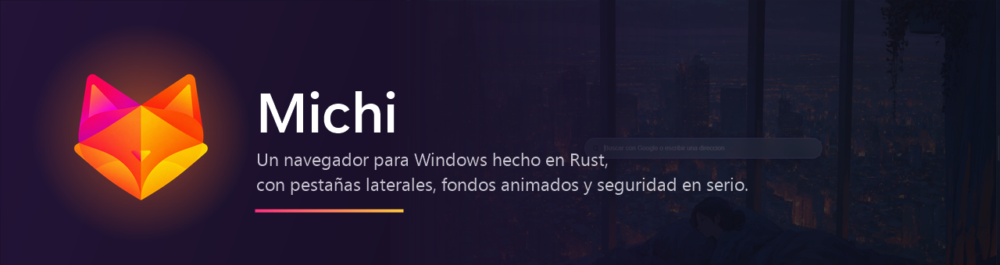

<br>


-0A7CFF?style=for-the-badge&logo=microsoftedge&logoColor=white)


### [Descargar el instalador](https://github.com/kilorito2/michi/releases/latest)

**[Funciones](#funciones)** ·
**[Seguridad](#seguridad)** ·
**[Instalador](#instalador)** ·
**[Compilar](#compilar)** ·
**[Arquitectura](#arquitectura)**

</div>

<br>

<p align="center">
  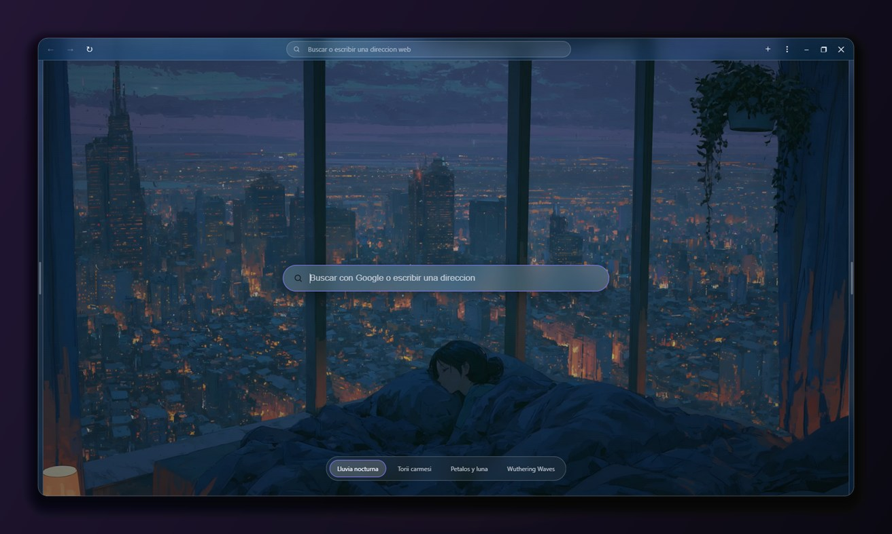
</p>

**Michi** es un navegador de escritorio para Windows con una idea distinta de
cómo se reparte la pantalla: **no hay barra de pestañas arriba**. La página ocupa
todo el espacio, y las pestañas aparecen deslizándose desde el borde derecho al
acercar el cursor; las descargas, el historial y los marcadores, desde el borde
izquierdo. Arriba queda solo una barra delgada de vidrio, con un **fondo animado**
que recorre toda la interfaz como si fuera una sola imagen.

Por dentro, cada pestaña es un motor **Chromium real** (WebView2, el mismo de
Microsoft Edge): cualquier sitio funciona como en un navegador normal. Encima de
eso, Michi suma su propia capa de **seguridad**: HTTPS primero, SmartScreen,
bloqueo de ventanas emergentes, extensiones con firma verificada y mucho más.

<br>

<a id="indice"></a>

##  Índice

- [Funciones](#funciones)
- [Seguridad](#seguridad)
- [Instalador](#instalador)
- [Compilar desde el código](#compilar)
- [Arquitectura](#arquitectura)
- [Decisiones de diseño](#decisiones)
- [Limitaciones conocidas](#limitaciones)
- [Hoja de ruta](#hoja-de-ruta)

<br>

<a id="funciones"></a>

##  Funciones

###  Pestañas al costado

Las pestañas viven en un panel de vidrio que se desliza desde el **borde
derecho** al acercar el cursor, y se esconde solo al alejarlo. La página nunca
cambia de tamaño: el panel pasa **por encima**, así nada salta ni se reacomoda.
Cada pestaña muestra el **logo del sitio** (su favicon real, tomado del propio
motor, sin pedirlo a ningún servicio externo); hasta que carga, un puntito.

<p align="center">
  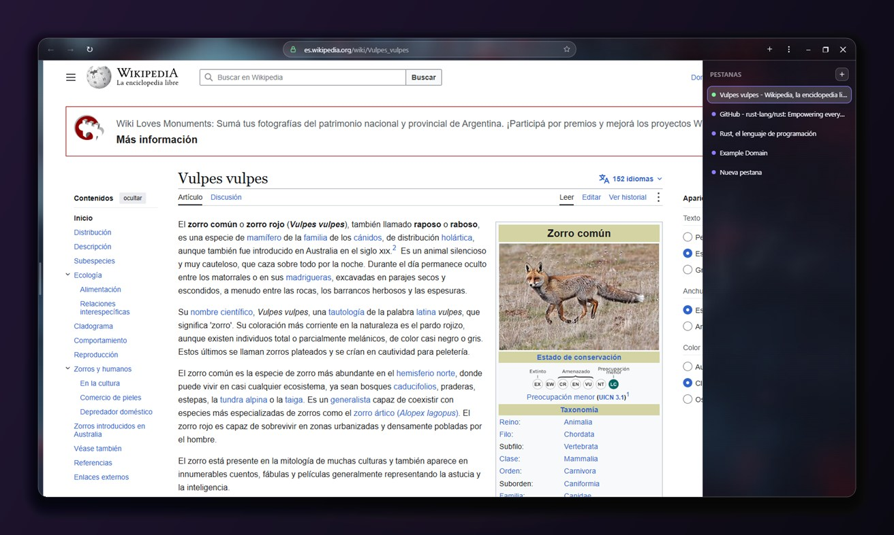
</p>

###  Barra de direcciones con sugerencias

Como en Firefox:

- Al entrar a la barra aparecen tus **sitios más visitados**, cada uno con su logo.
- Al escribir, se **completa en línea** el sitio que más visitas que empieza
  así: `y` → `youtube.com/`, con lo agregado seleccionado (seguir escribiendo
  lo reemplaza).
- Debajo, las **sugerencias de tu buscador** y lo que coincide de tu
  **historial**, tus **marcadores** y tus **pestañas abiertas** (con *Cambiar a
  la pestaña*), sin importar mayúsculas ni acentos.
- <kbd>↑</kbd> <kbd>↓</kbd> recorren la lista, <kbd>Enter</kbd> abre lo
  elegido y <kbd>Esc</kbd> cierra.

> Para las sugerencias de búsqueda, lo que escribes se envía al buscador
> elegido (como en Firefox o Chrome, pero sin cookies). Nunca se envía algo con
> forma de dirección: un sitio, `localhost` o una IP. Se apaga en **Ajustes ›
> General**, y el historial, los marcadores y las pestañas se siguen sugiriendo
> sin enviar nada. Los logos guardados de los sitios se borran junto con el
> historial.

###  Descargas, historial y marcadores

Desde el **borde izquierdo** (o con <kbd>Ctrl</kbd>+<kbd>H</kbd>): las descargas
con su progreso, pausa, reanudar y cancelar; el historial; y los marcadores. Los
archivos peligrosos esperan a que decidas **Conservar** o **Descartar**.

<p align="center">
  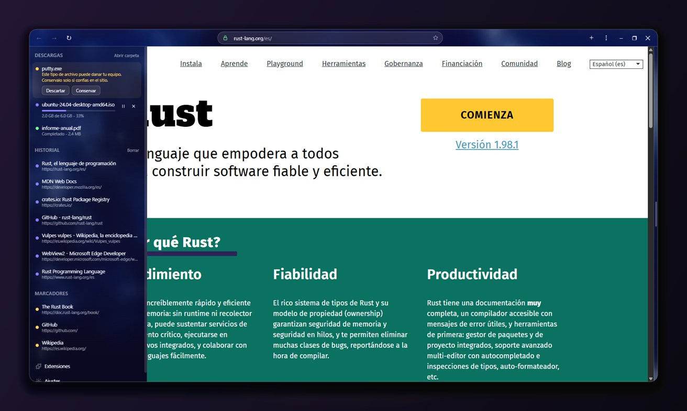
</p>

###  Fondos animados

Cuatro fondos animados (videos a 60 fps, o una imagen con un zoom lento) que se
ven detrás de toda la interfaz: la barra, los paneles, el menú y la pestaña nueva
muestran cada uno **su pedazo** del mismo fondo, sincronizados con el reloj del
sistema, así se ven como una sola imagen continua.

| Fondo | Tipo |
| --- | --- |
|  **Lluvia nocturna** | Video |
|  **Torii carmesí** | Imagen con zoom lento |
|  **Pétalos y luna** | Video |
|  **Wuthering Waves** | Video |

Se cambian desde la pestaña nueva o en **Ajustes › Apariencia**.

###  Importar de otro navegador

En **Ajustes › Importar**, Michi detecta los navegadores instalados en la PC y
trae, del perfil que elijas, tus **marcadores**, el **historial**, las
**sesiones iniciadas** (cookies) y las **pestañas abiertas**. Se agregan a lo que
ya tienes, sin reemplazar nada.

| Navegador | Qué trae |
| --- | --- |
| **Firefox** (y LibreWolf, Waterfox, Zen, Floorp) | Marcadores, historial, sesiones y pestañas abiertas. Firefox guarda sus cookies sin cifrar, así que las sesiones se copian tal cual: sigues conectado en los sitios. |
| **Chrome, Edge, Brave, Opera, Vivaldi** | Marcadores e historial. Estos navegadores cifran sus cookies con Windows (DPAPI), así que las sesiones **no** se importan: vas a tener que iniciar sesión de nuevo. |

> Para que las sesiones se copien bien, cierra antes el otro navegador. Las bases
> se leen sobre una copia temporal, así que no se toca ni se modifica nada del
> navegador de origen.

###  Extensiones de Chrome y Edge

Con la página de una extensión abierta en **Chrome Web Store** o **Complementos
de Edge**, la barra ofrece **Agregar a Michi**. El propio botón de la tienda
("Agregar a Chrome", "Obtener") también funciona: Michi no guarda el paquete
en Descargas, sino que lo pide directamente a la tienda oficial y lo instala.
También se instalan desde un `.crx`, un `.zip` o una carpeta.

Antes de instalar, Michi **verifica la firma digital** del paquete y muestra lo
que la extensión va a poder hacer:

> **Agregar "uBlock Origin Lite"?**
>
> Origen: Chrome Web Store, firma verificada.
>
> Va a poder:
> - Leer y cambiar todos tus datos en todos los sitios web
> - Bloquear o cambiar contenido de las páginas

Las que tienen ventana propia aparecen como un icono en la barra superior; su
popup se abre flotando debajo, como en Chrome, y actúa sobre la pestaña que
estás viendo.

###  Atajos de teclado

| Acción | Atajo |
| --- | --- |
| Nueva pestaña | <kbd>Ctrl</kbd> + <kbd>T</kbd> |
| Cerrar pestaña | <kbd>Ctrl</kbd> + <kbd>W</kbd> |
| Reabrir pestaña cerrada | <kbd>Ctrl</kbd> + <kbd>Mayús</kbd> + <kbd>T</kbd> |
| Pestaña siguiente / anterior | <kbd>Ctrl</kbd> + <kbd>Tab</kbd> / <kbd>Ctrl</kbd> + <kbd>Mayús</kbd> + <kbd>Tab</kbd> |
| Ir a la barra de direcciones | <kbd>Ctrl</kbd> + <kbd>L</kbd> o <kbd>Alt</kbd> + <kbd>D</kbd> |
| Recorrer las sugerencias de la barra | <kbd>↑</kbd> / <kbd>↓</kbd>, <kbd>Enter</kbd> para abrir, <kbd>Esc</kbd> para cerrar |
| Agregar / quitar marcador | <kbd>Ctrl</kbd> + <kbd>D</kbd> |
| Historial, descargas y marcadores | <kbd>Ctrl</kbd> + <kbd>H</kbd> |
| Menú | <kbd>Alt</kbd> + <kbd>F</kbd> |
| Buscar en la página | <kbd>Ctrl</kbd> + <kbd>F</kbd> |
| Recargar | <kbd>F5</kbd> |
| Zoom | <kbd>Ctrl</kbd> + <kbd>+</kbd> / <kbd>-</kbd> / <kbd>0</kbd> |
| Imprimir | <kbd>Ctrl</kbd> + <kbd>P</kbd> |
| Herramientas de desarrollador | <kbd>F12</kbd> |

###  Y además

- **Ajustes** (`app://localhost/settings`, desde el menú **⋮**): buscador
  predeterminado (Google, Bing, DuckDuckGo, Brave, Ecosia) y sus sugerencias, al iniciar (pestaña
  nueva o restaurar la sesión), fondo, zoom predeterminado, carpeta de
  descargas, privacidad y seguridad, extensiones.
- **Menú ⋮**: nueva pestaña, reabrir cerrada, zoom, marcador, imprimir,
  herramientas de desarrollador, extensiones, ajustes, acerca de, salir.
- **Michi predeterminado**: puede abrir los enlaces y archivos `.html` de
  otras aplicaciones (lo registra el instalador). Si Michi ya está abierto, lo
  pedido se abre en **una pestaña nueva de esa misma ventana**, que pasa al
  frente: nunca un segundo navegador.
- **Sonido con nombre**: en el mezclador de volumen de Windows, el sonido de las
  páginas aparece como **Michi**, con su icono. Lo reproduce un proceso de
  WebView2 (`msedgewebview2.exe`), y Michi le pone su nombre a esa sesión de
  audio cuando una pestaña empieza a sonar.
- Ajustes, marcadores, historial, sesión y extensiones se guardan en
  `%APPDATA%\Michi`.

<br>

<a id="seguridad"></a>

##  Seguridad

Lo que ya trae el motor Chromium se deja tal cual: procesos en *sandbox*,
aislamiento de sitios, política de mismo origen, HSTS, bloqueo de contenido
mixto, validación de certificados y actualizaciones de seguridad automáticas
(WebView2 *Evergreen* se actualiza solo, con Windows Update). Encima de eso,
Michi agrega su propia capa (ver [`src/security.rs`](src/security.rs)).

### La barra de direcciones te dice con quién hablas

<p align="center">
  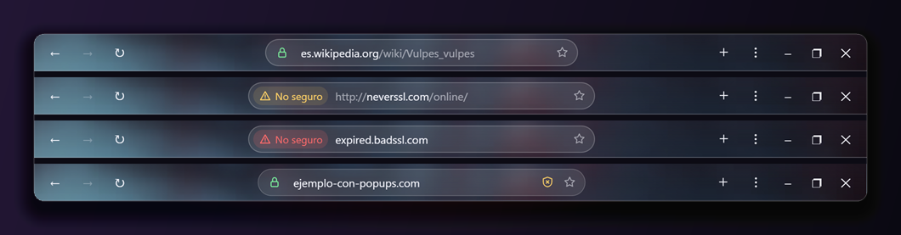
</p>

1.  **Conexión segura** (HTTPS).
2.  **No seguro**, en amarillo: el sitio se abrió sin cifrar (HTTP).
3.  **No seguro**, en rojo: el certificado del sitio no es válido.
4.  **El escudo**: la página intentó algo que se le bloqueó (una ventana
   emergente o abrir una aplicación externa). Tocándolo se abre igual la
   ventana emergente, si la querías.

El **dominio se ve resaltado** y el resto de la dirección atenuado, sin un
`usuario:clave@` delante que pueda disfrazarlo, y en su forma ASCII (`xn--…`) si
usa letras de otro alfabeto que imitan a las latinas. Además, al pasar el cursor
por un enlace, abajo se ve **a dónde lleva de verdad**.

### HTTPS primero

Toda dirección `http://` de un sitio público se intenta antes por `https://`.
Si el sitio no lo ofrece, según lo que elijas en Ajustes:

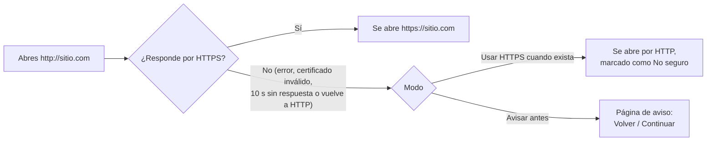

<p align="center">
  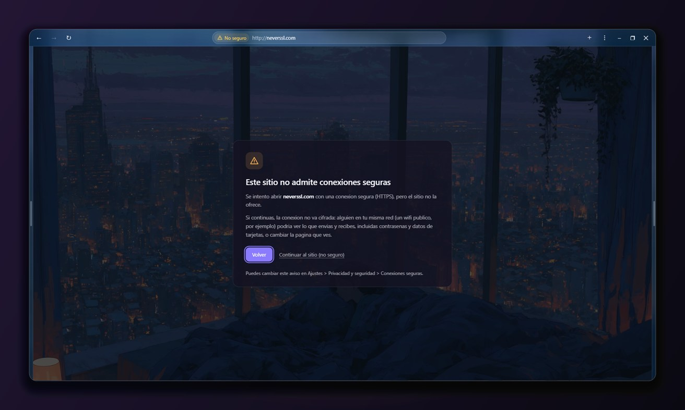
</p>

No se tocan `localhost`, las IP, los nombres de la red local ni los puertos no
estándar.

### Todas las medidas

| | Medida | Qué hace |
| :-: | --- | --- |
|  | **SmartScreen** | Filtro de Microsoft contra phishing, malware y descargas peligrosas. La librería base (wry) lo apaga por defecto; Michi lo enciende en todas sus vistas. |
|  | **HTTPS primero** | Intenta siempre la conexión cifrada (ver arriba). |
|  | **Bloqueo de ventanas emergentes** | Una pestaña nueva solo si la pide un clic. Nunca hacia archivos locales, `data:`, `javascript:` ni páginas internas, y sin `window.opener`. |
|  | **Aplicaciones externas** | Siempre se bloquean los esquemas con historial de ataques (`ms-msdt:`, `search-ms:`, `ms-officecmd:`, `ms-appinstaller:`, `hcp:`…) y cualquier otro que una página intente abrir sin un clic. |
|  | **Permisos** | Bloquear cámara, micrófono, ubicación, etc. para todos los sitios; nunca a sitios sin HTTPS; notificaciones solo después de un clic; lista de lo que tiene guardado cada sitio. |
|  | **Descargas peligrosas** | Ejecutables, scripts y accesos directos esperan tu decisión; imágenes, PDF, documentos o `.zip` se descargan sin preguntar. Lo que frena SmartScreen queda "Bloqueado". |
|  | **Marca de la Web** | Todo lo descargado lleva `Zone.Identifier`: Windows lo revisa antes de ejecutarlo y Office lo abre en Vista protegida. |
|  | **Firma de extensiones** | Los `.crx` se verifican como en Chrome (CRX3, RSA/ECDSA) y tienen que ser exactamente la extensión pedida. |
|  | **Anti *zip bomba*** | Las extensiones se descomprimen con topes (512 MB, 20 000 archivos) en una carpeta temporal. |
| 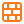 | **Páginas internas blindadas** | CSP con *nonce*, sin poder mostrarse dentro de un iframe ajeno, y `Cross-Origin-Resource-Policy`. |
|  | **IPC verificado** | Los comandos solo se aceptan según la URL real de la página que los envía (la pone WebView2, no se puede falsear), y cada página solo tiene los que usa. |
|  | **Prevención de seguimiento** | Básica, equilibrada o estricta. |
|  | **Sugerencias de búsqueda** | Solo se le envía al buscador lo que es una búsqueda, nunca una dirección, y sin cookies. Se pueden apagar. |
|  | **Borrar datos al cerrar** | Historial, logos de los sitios, cookies, caché y descargas; la sesión no se guarda. |
|  | **Proceso y ejecutable** | DLL solo desde ubicaciones seguras, Control Flow Guard, compatible con CET, DEP, ASLR y el runtime de C incluido. |

<p align="center">
  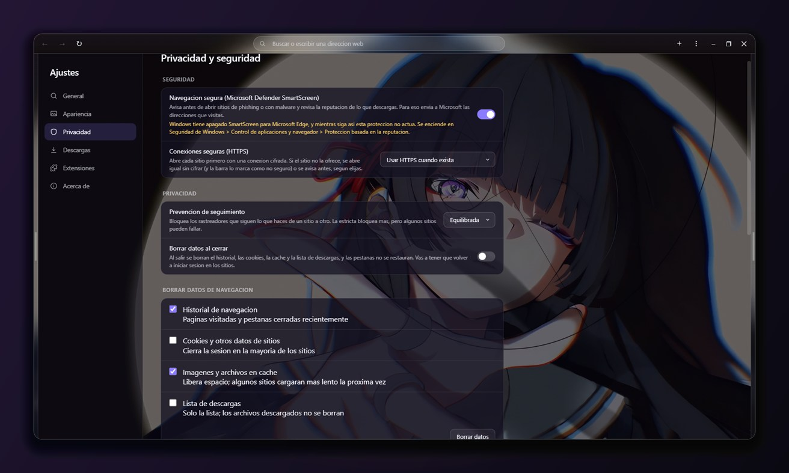
  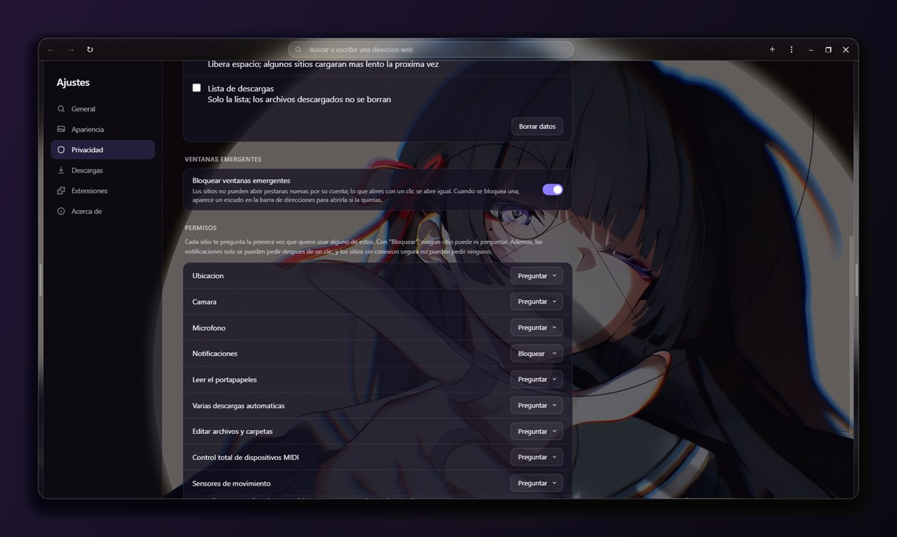
</p>

<details>
<summary> <b>Detalles técnicos de cada medida</b></summary>

<br>

**Navegación**

- **SmartScreen.** Si no se le pasan argumentos, wry arranca WebView2 con
  `--disable-features=…,msSmartScreenProtection`. Todos los WebView usan ahora
  los mismos argumentos sin eso (`security::BROWSER_ARGS`). WebView2 obedece
  además a la opción de Windows *SmartScreen para Microsoft Edge* (Seguridad de
  Windows › Control de aplicaciones y navegador › Protección basada en la
  reputación): si está apagada, SmartScreen no actúa, y Ajustes lo avisa.
- **HTTPS primero** se hace en `NavigationStarting`: la navegación a `http://`
  se cancela y se repite por `https://`; si el intento falla
  (`NavigationCompleted`, un error de certificado, una redirección de vuelta a
  HTTP o 10 s sin respuesta), se vuelve a HTTP y el host queda permitido por la
  sesión. Atrás/adelante/recargar no se desvían.
- **Ventanas emergentes**: la pestaña nueva la abre la app (para el motor, la
  abrió el usuario), así que sin el filtro de destinos una página se saltearía
  los bloqueos de Chromium para `file:`, `data:` y páginas internas.
- `window.close()` desde una página cierra su pestaña.

**Interfaz y páginas propias**

- La barra, los paneles y el menú no pueden navegar fuera de su página (ni
  soltándoles encima un enlace o un archivo): una página ajena ahí tendría
  todos los comandos de `ipc::dispatch`.
- El IPC se acepta según la URL del documento que lo envía y no según en qué
  página "está" la pestaña: si no, un sitio que navegaba hacia los Ajustes
  podía mandar en ese instante comandos como si fuera los Ajustes.
- La barra decide si una URL es interna con la respuesta de Rust (origen
  exacto), no buscando `app.localhost` en el texto.
- Los iconos de extensiones llevan una clave al azar por sesión: sin ella, un
  sitio podría averiguar qué extensiones hay instaladas.

**Extensiones** ([`src/crx.rs`](src/crx.rs))

- CRX3: todas las firmas tienen que ser válidas y una de las claves tiene que
  ser la que da el id de la extensión. Es lo que protege la descarga:
  Complementos de Edge entrega los paquetes por HTTP, sin cifrar.
- Los `.zip` y las carpetas se marcan como "sin firma" en la confirmación.
- Si la tienda descarga un `.crx` (su propio botón de agregar), la descarga se
  cancela y el paquete se vuelve a pedir a la tienda oficial por su id: nunca
  se instala lo que haya entregado la página.
- La tienda de Chrome es una aplicación de una sola página: las navegaciones
  internas (`history.pushState`) se siguen con el evento `SourceChanged` de
  WebView2, así la barra muestra la dirección real y ofrece "Agregar a Michi".

**Descargas** ([`src/downloads.rs`](src/downloads.rs))

- Solo los tipos que pueden ejecutar algo (`.exe`, `.msi`, `.bat`, `.ps1`,
  `.js`, `.lnk`, imágenes de disco…) quedan en suspenso hasta que el usuario
  decide; imágenes, PDF, documentos o `.zip` se descargan sin preguntar.
- Una página que intente guardar uno de esos tipos por su cuenta (File System
  Access) no puede.
- Todo lo descargado lleva la marca de la web (`Zone.Identifier`), así Windows
  avisa antes de abrirlo.

**Proceso y ejecutable** ([`.cargo/config.toml`](.cargo/config.toml))

- `SetDefaultDllDirectories` + política de carga de imágenes: nada de DLL
  desde la carpeta actual, el PATH, carpetas de red o archivos de integridad baja.
- `/DEPENDENTLOADFLAG:0x800`: las DLL importadas, solo de System32.
- Control Flow Guard, `/CETCOMPAT`, `crt-static`; en release, `overflow-checks`.

</details>

<br>

<a id="instalador"></a>

##  Instalador

Michi tiene su propio instalador, hecho con la misma base que el navegador
y con su misma estética: el **fondo animado detrás del vidrio** (que cambia en
vivo al elegir otro), el zorro y los colores de su degradado.

**Descarga:** `Michi-Setup-0.1.2.exe` en
[Releases](https://github.com/kilorito2/michi/releases/latest). No está firmado
digitalmente, así que Windows puede mostrar el aviso de SmartScreen la primera
vez: *Más información › Ejecutar de todas formas*.

<table>
  <tr>
    <td width="50%">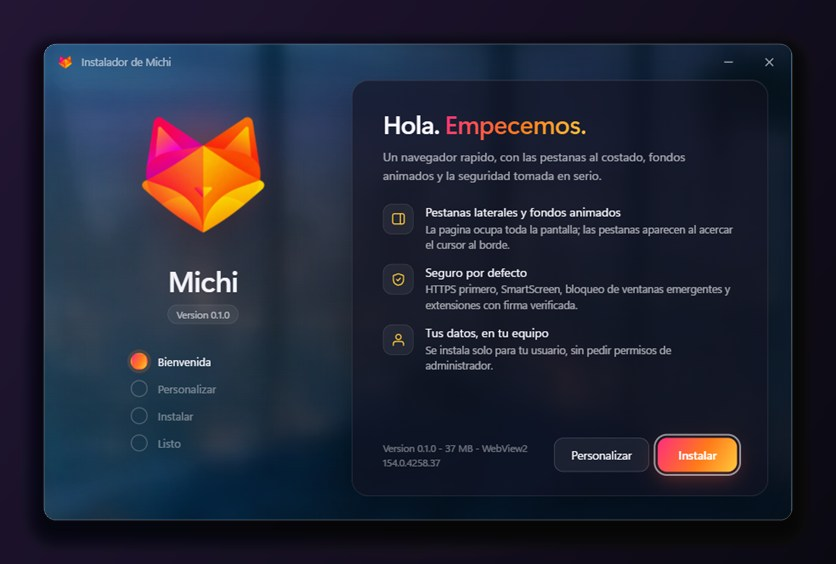</td>
    <td width="50%">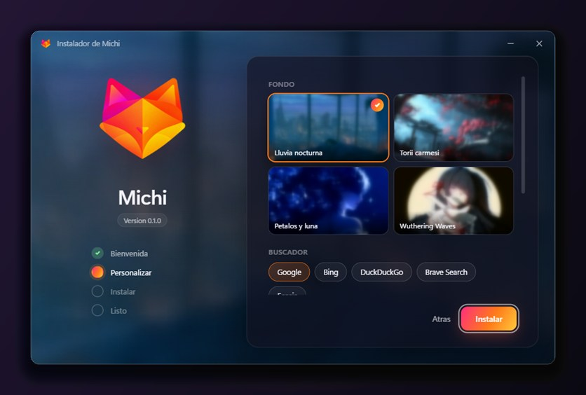</td>
  </tr>
  <tr>
    <td align="center"><b>1.</b> Bienvenida</td>
    <td align="center"><b>2.</b> Personalizar: fondo, buscador, accesos directos y carpeta</td>
  </tr>
  <tr>
    <td width="50%">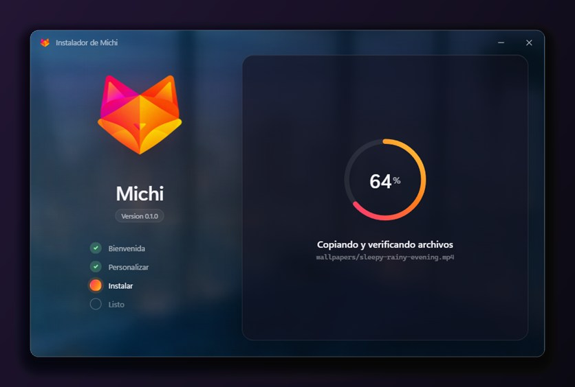</td>
    <td width="50%">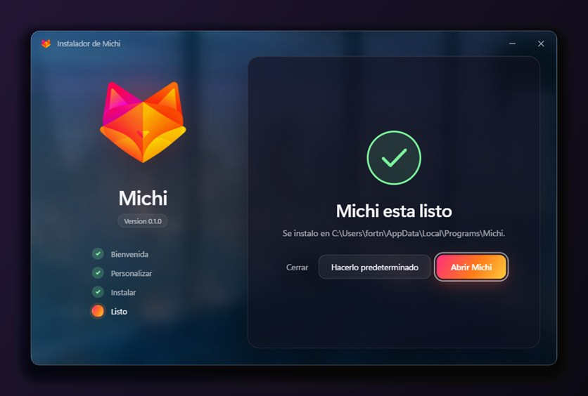</td>
  </tr>
  <tr>
    <td align="center"><b>3.</b> Copiando y verificando cada archivo</td>
    <td align="center"><b>4.</b> Listo: abrirlo o hacerlo predeterminado</td>
  </tr>
</table>

-  **Sin permisos de administrador**: se instala solo para tu usuario, en
  `%LOCALAPPDATA%\Programs\Michi`.
-  **Actualizar o reinstalar** sin perder ajustes, marcadores, historial,
  extensiones ni el perfil.
-  **Cada archivo se verifica** (SHA-256) antes de reemplazar al anterior: un
  instalador cortado no deja una instalación a medias.
-  **Michi predeterminado**: lo registra para `http`, `https` y `.html`
  (Windows deja elegirlo en *Aplicaciones predeterminadas*; ningún programa puede
  ponerse solo).
-  Aparece en **Aplicaciones instaladas** y en *Aplicaciones predeterminadas*
  como **Michi** (el `.exe` lleva su nombre en la información de versión), con
  desinstalador.
-  **Quita la versión anterior** de cuando se llamaba "Navegador": su registro,
  accesos directos y archivos del programa. El perfil viejo (sesiones) se muda a
  Michi si todavía no tiene uno; si ya tiene, queda donde estaba: nunca se
  borran datos del usuario.
-  Si el navegador está abierto, pide cerrarlo antes; si falta WebView2,
  ofrece descargarlo.

<details>
<summary> <b>El desinstalador</b></summary>

<br>

<p align="center">
  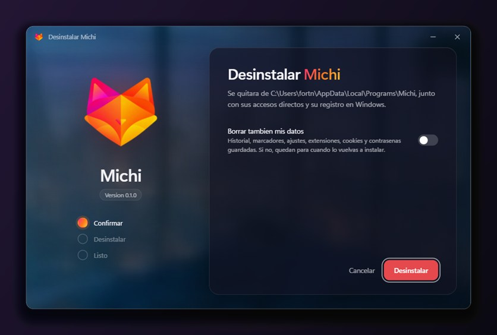
</p>

Es el mismo programa sin los archivos del navegador. Como un programa no puede
borrar su propio `.exe` mientras corre, se copia a la carpeta temporal y sigue
desde ahí. Borra **solo lo que instaló** (nunca una carpeta entera a ciegas) y,
si lo pides, también tus datos.

</details>

### Generar el instalador

```powershell
powershell -ExecutionPolicy Bypass -File tools\build_installer.ps1
```

Genera **`dist\Michi-Setup-<versión>.exe`** (~39 MB, un solo archivo):
compila en *release* el navegador y el instalador (`installer/`) y le pega al
final del instalador el `.exe` y los fondos, con el SHA-256 de cada uno.

```text
┌────────────────┬──────────────┬─────┬──────────────┬───────────────┬──────────┬──────────┐
│  instalador    │  archivo 1   │ ... │  archivo N   │ índice (JSON) │ largo    │ MICHISET │
│  (.exe)        │  michi.exe   │     │ wallpapers/… │ rutas + SHA256│ (u64 LE) │ (firma)  │
└────────────────┴──────────────┴─────┴──────────────┴───────────────┴──────────┴──────────┘
```

> [!NOTE]
> El instalador no está firmado digitalmente (hace falta un certificado de firma
> de código), así que Windows puede advertir de un "editor desconocido".

<br>

<a id="compilar"></a>

##  Compilar desde el código

### Requisitos

- **Windows 10 u 11** con [Microsoft Edge WebView2 Runtime](https://developer.microsoft.com/microsoft-edge/webview2/)
  (viene con Windows 11 y con casi todos los Windows 10).
- **Rust** ([rustup](https://rustup.rs/)) con el *toolchain* MSVC.
- **Visual Studio Build Tools** (C++ y el Windows SDK).
- Para regenerar los fondos: **ffmpeg** y **bash** (Git Bash).

### Pasos

```powershell
git clone <url-del-repo>
cd Michi

# Ejecutar en modo desarrollo
cargo run

# Pruebas
cargo test --workspace
```

> [!IMPORTANT]
> Los videos de fondo **no están en el repositorio** (`assets/wallpapers/` está
> en `.gitignore`). Para compilar hacen falta las versiones optimizadas en
> `assets/wallpapers/optimized/`: pon los originales en `assets/wallpapers/` y
> ejecuta `bash tools/encode_wallpapers.sh <archivo>` (ver
> [Fondos animados](#fondos-animados)). Sin ellos, el navegador compila igual
> (los fondos simplemente no se ven), pero el instalador no.

### Útil para desarrollar

| | |
| --- | --- |
| `MICHI_DATA_DIR=<carpeta>` | Usa otra carpeta de datos: para probar sin tocar tus datos reales. |
| `cargo test -- --ignored` | Además descarga extensiones reales de las dos tiendas y verifica su firma. |
| Consola | En *debug* el navegador muestra sus mensajes (`[seguridad]`, `[ipc]`); en *release* no abre consola. |
| `crash.log` | Si el navegador se cierra por un error, el detalle queda en la carpeta de datos. |
| `tools\make_icon.ps1` | Regenera el `.ico` y el logo desde `assets/icon/michi.png`. |

<br>

<a id="arquitectura"></a>

##  Arquitectura

Cada pestaña es un **WebView real e independiente** (motor Chromium vía
WebView2), no un `<iframe>`. Esto es clave: un iframe no puede mostrar Google,
GitHub, bancos, etc., porque esos sitios bloquean ser incrustados. Con un
WebView nativo por pestaña, cualquier sitio funciona igual que en un navegador
normal.

La barra superior, los paneles y el menú son **otros WebViews**, con su propio
HTML/CSS/JS (carpeta [`ui/`](ui)). Rust es el centro: recibe los comandos de las
páginas (IPC) y les empuja el estado.

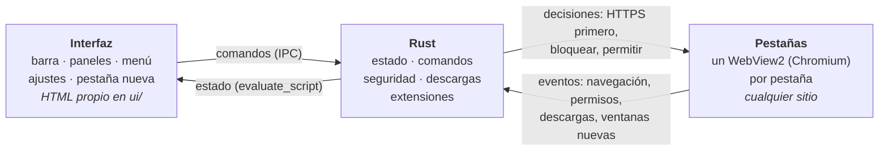

<details>
<summary> <b>Estructura del proyecto</b></summary>

```text
src/
  main.rs         punto de entrada, ventana, bucle de eventos (winit)
  state.rs        estado central (AppState) compartido vía Rc<RefCell<_>>
  storage.rs      ajustes/marcadores/historial/sesión en disco + buscadores
  chrome.rs       construye los WebViews de la interfaz
  menu.rs         menú ⋮ (un WebView propio que se muestra/oculta)
  tabs.rs         crear/cerrar pestañas (WebViews de contenido)
  layout.rs       posición y tamaño de cada WebView
  panels.rs       apertura/cierre animado de los paneles + vigilante del cursor
  actions.rs      acciones diferidas (atajos, menú) fuera de los callbacks
  shortcuts.rs    atajos de teclado (AcceleratorKeyPressed de WebView2)
  extensions.rs   instalar/listar/activar/quitar extensiones
  crx.rs          verificar la firma de los paquetes .crx (CRX3)
  popup.rs        popup de una extensión (su icono en la barra)
  downloads.rs    descargas con progreso / pausa / archivos peligrosos
  import.rs       importar marcadores/historial/cookies/pestañas de otros navegadores
  suggest.rs      sugerencias de la barra: completar en línea, buscador, historial
  audio.rs        nombre e icono de Michi en el mezclador de volumen
  security.rs     medidas de seguridad
  permissions.rs  permisos de los sitios
  win.rs          maximizar sin tapar la barra de tareas
  single_instance.rs  un solo Michi: los enlaces/archivos van al que ya está abierto
  native.rs       API de WebView2 que wry no expone
  protocol.rs     protocolo app:// (páginas propias y fondos)
  ipc.rs          comandos que la interfaz (JS) envía a Rust
  sync.rs         Rust → interfaz: empuja el estado
ui/
  topbar.html         barra superior
  sidebar_right.html  panel de pestañas
  sidebar_left.html   panel de descargas/historial/marcadores
  menu.html           menú ⋮
  suggest.html        desplegable de sugerencias de la barra
  settings.html       ajustes y extensiones
  newtab.html         pestaña nueva
  insecure.html       aviso "este sitio no admite conexiones seguras"
  ext_popup.js        se inyecta en el popup de una extensión
  content_init.js     se inyecta en cada pestaña
  wallpaper.js        fondo animado compartido
installer/            el instalador
  src/main.rs         ventana, interfaz, instalar/desinstalar en otro hilo
  src/install.rs      los pasos de instalar y desinstalar
  src/payload.rs      los archivos pegados al .exe (y su verificación)
  src/system.rs       registro, accesos directos, procesos
  ui/index.html       la interfaz del instalador
tools/
  encode_wallpapers.sh  genera assets/wallpapers/optimized/
  make_icon.ps1         genera michi.ico y michi-256.png
  build_installer.ps1   genera dist\Michi-Setup-<versión>.exe
assets/icon/          el zorro: original, .ico y logo
docs/img/             imágenes de este README
```

</details>

**Motor:** [wry 0.57](https://github.com/tauri-apps/wry) (WebView2) +
[winit 0.30](https://github.com/rust-windowing/winit) (ventana y eventos).

<br>

<a id="decisiones"></a>

##  Decisiones de diseño

<details>
<summary> <b id="fondos-animados">Fondos animados: cómo se ven como una sola imagen</b></summary>

<br>

Cada superficie (barra, paneles, menú, pestaña nueva) es un WebView distinto y
decodifica su propio `<video>`, así que el costo se multiplica. Por eso la app no
sirve los originales 4K de `assets/wallpapers/`, sino las versiones de
`assets/wallpapers/optimized/` que genera `tools/encode_wallpapers.sh`:

- `<tema>.mp4`: 1920×1080 a 60 fps (los originales a 30 fps se interpolan), para
  la pestaña nueva.
- `<tema>.blur.mp4`: 640×360 a 60 fps con el desenfoque y la saturación del
  vidrio ya aplicados, para la barra y los paneles (antes lo hacía
  `backdrop-filter` en cada cuadro).

`protocol.rs` lee solo el rango pedido por el `<video>`, en un hilo aparte.
`ui/wallpaper.js` sincroniza todas las superficies con el reloj del sistema (para
que se vean como un único fondo), cambia de tema sin dejar un hueco mientras
carga el nuevo y pausa el video de las pestañas en segundo plano. Un fondo
también puede ser una imagen fija (`.jpg`), animada con un zoom lento por CSS.

Para agregar un fondo: poner el original en `assets/wallpapers/`, sumarlo a
`JOBS` en el script y a `THEMES` en `protocol.rs` (y a `STILLS` si es una
imagen) y correr `bash tools/encode_wallpapers.sh <archivo original>`.

</details>

<details>
<summary>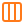 <b>Paneles que se deslizan sin parpadear</b></summary>

<br>

El WebView de cada panel mide siempre 300 px; cerrado queda casi entero fuera de
la ventana y solo asoma una franja de 10 px en el borde. La página del panel
avisa cuando el cursor **entra**, y Rust lo desliza hacia adentro **moviendo** el
WebView cuadro a cuadro: nunca lo redimensiona, porque WebView2 no repinta
mientras se lo redimensiona, pero moverlo es gratis. El **cierre** lo decide Rust
(`src/panels.rs`) mirando la posición real del cursor, y lo cierra cuando lleva
~200 ms fuera (`mouseleave` se perdía al mover el mouse rápido).

Como wry no expone el orden de apilamiento entre WebViews, `layout::relayout`
vuelve a subir la barra y los paneles al tope con `SetWindowPos` cada vez que
cambia algo.

</details>

<details>
<summary> <b>Por qué casi todo es "diferido"</b></summary>

<br>

Las pestañas nuevas se crean en la próxima vuelta del bucle de eventos, no
dentro del callback de WebView2 que las pide (botón **+**, `target=_blank`):
crear un WebView ahí adentro se colgaba (ver `AppState::request_tab`). Lo mismo
con cerrar pestañas o navegar desde un evento: se encolan como `Action` y corren
fuera de los callbacks.

Las páginas de interfaz y la pestaña nueva se sirven por el protocolo `app://`
(no con `with_html`), para que la ruta relativa del video de fondo resuelva y se
vea el mismo fondo en toda la interfaz.

</details>

<details>
<summary> <b>La portada de Google, en oscuro</b></summary>

<br>

`ui/content_init.js` se inyecta en cada pestaña, pero solo actúa cuando la página
es exactamente la portada de Google: la deja en un tono oscuro liso que combina
con la interfaz, con solo la barra de búsqueda. Se probó un fondo realmente
transparente, pero WebView2 reservaba ahí una región blanca opaca que no
respondía a CSS, así que se optó por un color sólido.

</details>

<br>

<a id="limitaciones"></a>

##  Limitaciones conocidas

- **Cerrar la ventana termina el proceso de inmediato** en vez de un apagado
  prolijo (salvo con "Borrar datos al cerrar", que espera a que termine). Lo
  importante ya se guarda en cada cambio.
- **`window.open()` y `target="_blank"`** abren una pestaña nueva, sin
  `window.opener`; algunos inicios de sesión por ventana emergente (OAuth)
  pueden no funcionar.
- **Extensiones sin popup** (las que hacen algo directo al tocar su icono) no
  aparecen en la barra: WebView2 no permite disparar ese evento desde afuera.
- **SmartScreen depende de Windows**: si *SmartScreen para Microsoft Edge* está
  apagado en Seguridad de Windows, WebView2 no lo usa.
- **Mezcladores de audio de terceros** (SteelSeries Sonar y similares) pueden
  seguir mostrando `msedgewebview2` si identifican el sonido por el nombre del
  proceso en vez del nombre de la sesión de audio. El mezclador de Windows
  muestra "Michi".
- El efecto vidrio difumina el fondo animado, no los píxeles de la página de
  atrás: WebView2 no permite mezclar el contenido de dos WebViews.

<br>

<a id="hoja-de-ruta"></a>

##  Hoja de ruta

- [ ] Carpetas y edición de marcadores; buscar en el historial.
- [ ] Modo incógnito (un WebView con `with_incognito`).
- [ ] Reordenar pestañas arrastrándolas en el panel.
- [x] Una sola instancia: los enlaces de otras aplicaciones abren una pestaña en la ventana abierta.
- [x] Sugerencias en la barra de direcciones.
- [ ] Firmar el instalador.

<br>

## Licencia

El código de Michi se publica bajo la [licencia MIT](LICENSE).

Los fondos animados que trae el instalador son obra de sus respectivos autores
y no forman parte del código del repositorio ni de esta licencia.

<br>

<div align="center">


**Michi** · hecho en Rust con WebView2

</div>
